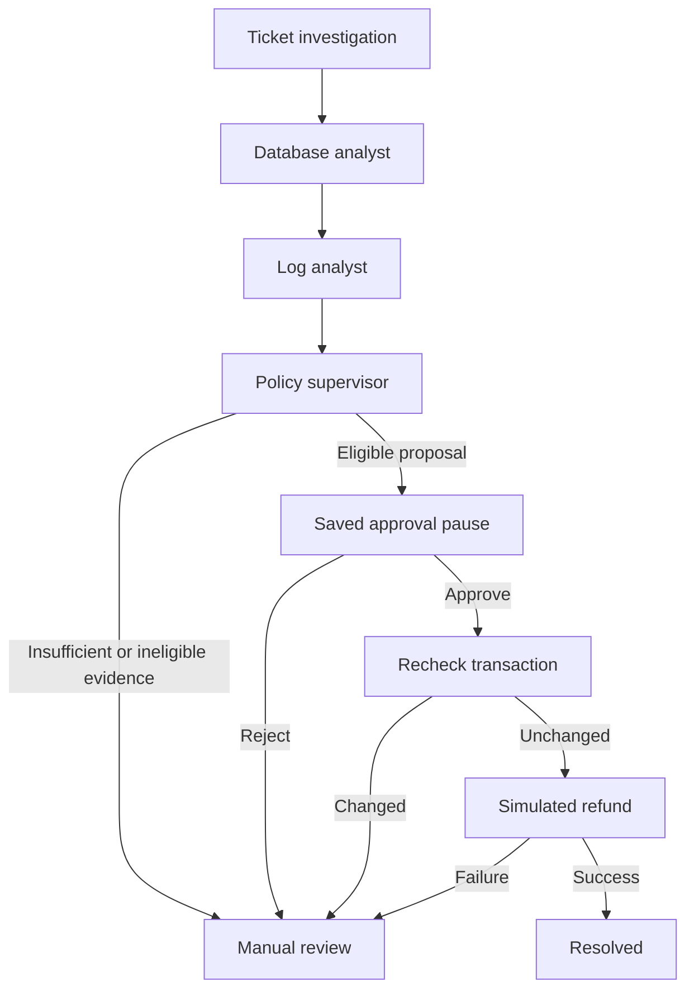

# Architecture and learning guide

## Request flow

The browser displays Streamlit. Streamlit's server authenticates to FastAPI using a shared API key. FastAPI stores tickets in SQLAlchemy-managed tables. A LangGraph workflow reads the associated records, prepares a proposal, saves a checkpoint, and pauses for approval. A later request resumes that same workflow thread.

## Data model

| Table | Stores |
| --- | --- |
| `demo_orders` | Fictional order status and integer amount in minor units |
| `demo_payments` | One payment per sample order |
| `demo_logs` | Evidence of transaction events |
| `support_tickets` | Complaint linked to an order |
| `investigations` | Run status, evidence snapshot, proposal, reviewer, decision |
| `simulated_refunds` | One simulated refund per payment and per run |
| `audit_events` | Ticket creation, investigation, approval/rejection, and action events |
| LangGraph checkpoint tables | Saved state and pending workflow steps |

For PKR, `250000` minor units represents PKR 2,500.00. Integer money values avoid floating-point rounding errors. The demo supports full refunds only and assumes one payment per order.

## Investigation stages

1. The database analyst runs fixed read queries. No LLM-generated SQL is executed.
2. The log analyst reads events for the linked order.
3. The supervisor checks the order, captured payment, matching amounts/currency, previous refund, and an order-failure event.
4. If configured, Gemini explains that already-determined policy result. It receives no execution credentials or tools.
5. Eligible plans reach `interrupt()`. LangGraph persists this pause with the investigation ID as `thread_id`.
6. The API stores the human decision before invoking `Command(resume=...)`.
7. The action executor checks the stored approval and current transaction fingerprint before changing business records.

No hidden chain-of-thought is generated or stored. The dashboard shows evidence, policy findings, and concise explanations.

## Recovery and duplicate prevention

- The same ticket's pending investigation is returned instead of creating another one.
- Identical approval retries reuse the saved decision; a conflicting later decision is rejected.
- The refund table enforces uniqueness for payment ID and run ID.
- PostgreSQL row locks protect the order and payment during execution.
- A demo-wide PostgreSQL advisory lock serializes API mutations across instances. SQLite uses a process-local lock and must run with one worker.
- The business refund transaction may commit before LangGraph saves its next checkpoint. If a process fails in that interval, replay finds the existing refund for the same run and returns it instead of issuing another.
- The recovery endpoint never invents approval. A saved pause with no decision stays paused.
- Ticket resolution is written only after a successful or already-completed simulated action.

The approval/execution flow is synchronous. It is suitable for a small demo, not high-volume support operations. For scale, use background jobs, per-investigation coordination, timeouts, and a real job status interface.

## Integration with the original BRD

The demo implements the core investigate → propose → pause → approve/reject → execute flow. It deliberately uses fixed specialist stages instead of an autonomous LLM supervisor router, and an in-process commerce adapter instead of separate POS HTTP APIs. These choices make the educational project runnable without POS source or credentials.

For the real POS, request supported APIs for tickets, sales, payments, logs, status updates, and refunds. Replace `snapshot()` and log reads with restricted data adapters; replace `execute_simulated_refund()` with the provider's authenticated action API. Preserve approval, idempotency, outcome verification, and audit history. Handle asynchronous payment-provider statuses before closing real tickets.

## Before production use

Add individual authentication and role-based approval, secure session management, rate limiting, backups, schema migrations, restricted database roles, tenant isolation where applicable, and independent policy review. Replace the self-reported reviewer label with the authenticated user ID. Approval scope should include immutable action parameters and any expiry rules. Never treat the demo's shared workspace password as enterprise identity management.
